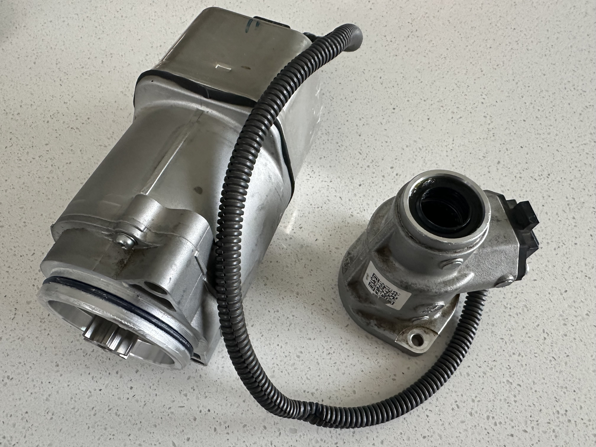
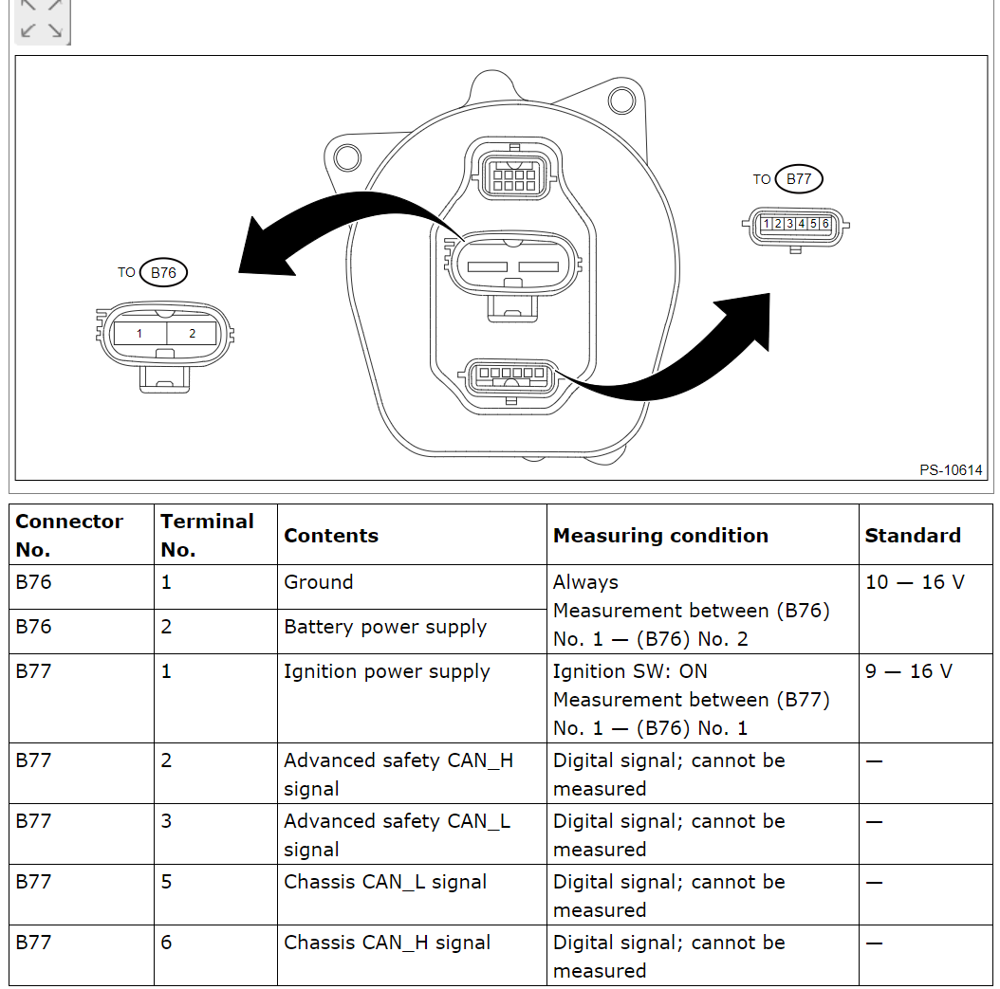

# Subaru EPS firmware decrpytion and analysis

### pk2 decryption thanks to [atlas-tuning](https://github.com/atlas-tuning)!
https://github.com/atlas-tuning/utilities/blob/main/java/src/main/java/com/github/manevolent/atlas/ssm4/PakFile.java


## Firmware Update Analysis
### Getting Started
modify common.py to the path to your SSM4 installation

```bash
pip install -r requirements.txt
sudo apt install -y binwalk
python decrypt_fw.py # decrypt example firmware
python decrypt_xml.py # decrypt xml

ls output/DB/ # XML data about how SSM4 operates and keys
ls output/FW/ # extracted versions of firmware
```

#### 2021 outback EPS (EU):

##### 34110AN021_AN031.pk2
- output/FW/34110AN021_AN031/eps_RM11FE00.mot appears to be rom section

```bash
# Determine format
binwalk output/FW/34110AN021_AN031/eps_RM11FE00.mot

DECIMAL       HEXADECIMAL     DESCRIPTION
--------------------------------------------------------------------------------
0             0x0             Motorola S-Record; binary data in text format, record type: data (32-bit)
1048617       0x100029        Motorola S-Record; binary data in text format, record type: data (32-bit)

# Extract files to output/eps/_eps_RM11FE00.mot.extracted
binwalk --dd=".*" -C output/eps/ output/FW/34110AN021_AN031/eps_RM11FE00.mot
```

- Format: [Motorola S-record](https://en.wikipedia.org/wiki/SREC_(file_format))

*Firmware is encrpyted and decrpyted during flashing process by the ECU itself, need to dump firmware directly from the EPS to get the key*

## Firmware Dump:
<br/>
*subaru eps taken from steering rack*

<br/>
*subaru eps pinout*

